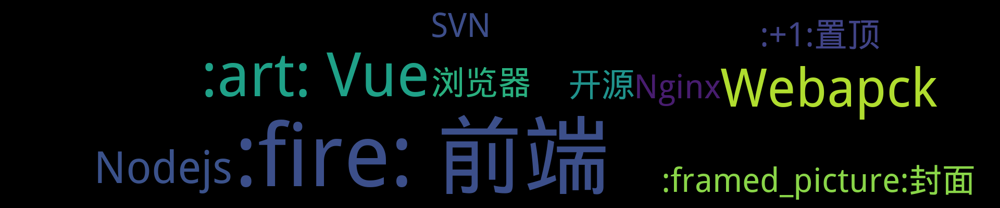

<p align='center'>
    
    
    
    
    
    
    
</p>

<p align='center'>
    <a href="https://github.com/cklwblove/visitor-count-badge">
        
    </a>
</p>


## 置顶 :thumbsup: 
- [微信浏览器H5页面软键盘关闭导致页面空缺的问题](https://github.com/cklwblove/blog/issues/2)  <sup>0 :speech_balloon:</sup>  	 
## 最新 :new: 

#### [关于vue-router中点击浏览器前进后退地址栏路由变了但是页面没跳转](https://github.com/cklwblove/blog/issues/68) <sup>0 :speech_balloon:</sup> 	 2020-08-07 02:08:03

:label: : 

> 摘自 https://www.cnblogs.com/mmzuo-798/p/10260327.html

正文如下：
<a name="SiL76"></a>
### **情景：**
在进行正常页面跳转操作后（页面A跳转到页面B），点击浏览器的左上角的‘后退’按钮，点击后，可以看到u

[更多>>>](https://github.com/cklwblove/blog/issues/68)

---


#### [解决因为手机设置字体大小导致h5页面在webview中变形的BUG](https://github.com/cklwblove/blog/issues/67) <sup>0 :speech_balloon:</sup> 	 2020-08-06 10:06:16

:label: : 

解决因为手机设置字体大小导致 h5 页面在 webview 中变形的 BUG
首先，我们做了一个 H5 页面，在各种手机浏览器中打开都没问题。我们采用了 rem 单位进行布局，通过 JS 来动态计算网页的视窗宽度，动态设置 html 的 font-size，一切都比较完美。

这时候，你自信满

[更多>>>](https://github.com/cklwblove/blog/issues/67)

---


#### [Safari 浏览器播放音频视频流异常处理](https://github.com/cklwblove/blog/issues/66) <sup>0 :speech_balloon:</sup> 	 2020-07-28 09:49:43

:label: : 

使用普通文件流的方式播放音频视频文件在Google Chrome和安卓中都可以正常播放, 在Safari 浏览器和IOS中播放会不正常, 具体表现为只能播放部分音频视频,播放一定时长就后就会停掉. 这是因为Safari 浏览器播放音频视频是边下边播放, 当已下载的内容快播放完的时候,会继续下载新的内

[更多>>>](https://github.com/cklwblove/blog/issues/66)

---


#### [前端要处理防止多次点击实现方案](https://github.com/cklwblove/blog/issues/65) <sup>0 :speech_balloon:</sup> 	 2020-07-22 15:04:30

:label: : 


[更多>>>](https://github.com/cklwblove/blog/issues/65)

---


#### [修复 HMR(热更新)失效](https://github.com/cklwblove/blog/issues/64) <sup>0 :speech_balloon:</sup> 	 2020-07-15 13:47:15

:label: : 

```js
module.exports = {
  chainWebpack: config => {
    // 修复HMR
    config.resolve.symlinks(true);
  }
};
```


[更多>>>](https://github.com/cklwblove/blog/issues/64)

---


## 分类  :card_file_box:

<details open="open">
    <summary>
        
        <p align="center">:cloud: 词云 :cloud: <sub>点击词云展开详细分类:point_down: </sub></p>
    </summary>


<details>
<summary>:+1:置顶	<sup>1:newspaper:</sup></summary>

- [微信浏览器H5页面软键盘关闭导致页面空缺的问题](https://github.com/cklwblove/blog/issues/2)  <sup>0 :speech_balloon:</sup>  	 


</details>

<details>
<summary>:art: Vue	<sup>5:newspaper:</sup></summary>

- [vue mixins](https://github.com/cklwblove/blog/issues/59)  <sup>0 :speech_balloon:</sup>  	 
- [vue 定时器问题](https://github.com/cklwblove/blog/issues/57)  <sup>0 :speech_balloon:</sup>  	 
- [Error in nextTick: "InvalidCharacterError: Failed to execute 'setAttribute' on 'Element': '`' is not a valid attribute name."](https://github.com/cklwblove/blog/issues/48)  <sup>0 :speech_balloon:</sup>  	 
- ["NavigationDuplicated" errors(解决多次点击重复路由报错)](https://github.com/cklwblove/blog/issues/44)  <sup>0 :speech_balloon:</sup>  	 
- [vue项目刷新当前页面](https://github.com/cklwblove/blog/issues/34)  <sup>0 :speech_balloon:</sup>  	 


</details>

<details>
<summary>:fire: 前端	<sup>18:newspaper:</sup></summary>

- [移动端混合式开发时，html强缓存的问题](https://github.com/cklwblove/blog/issues/61)  <sup>1 :speech_balloon:</sup>  	 
- [Gradient has outdated direction syntax. New syntax is like `closest-side at 0 0` instead of `0 0, closest-side`](https://github.com/cklwblove/blog/issues/60)  <sup>0 :speech_balloon:</sup>  	 
- [微信图片带有logo的二维码，有些机型长按不能识别](https://github.com/cklwblove/blog/issues/56)  <sup>0 :speech_balloon:</sup>  	 
- [ElementUI如何展开指定Tree树节点](https://github.com/cklwblove/blog/issues/55)  <sup>0 :speech_balloon:</sup>  	 
- [H5页面监听Android物理返回键](https://github.com/cklwblove/blog/issues/53)  <sup>0 :speech_balloon:</sup>  	 
- [检测 <video>是否开始播放（加载到资源有了画面）的方法](https://github.com/cklwblove/blog/issues/51)  <sup>0 :speech_balloon:</sup>  	 
- [打包构建后，js文件移除 'use strict'](https://github.com/cklwblove/blog/issues/50)  <sup>0 :speech_balloon:</sup>  	 
- [H5在移动端遇到的常见问题](https://github.com/cklwblove/blog/issues/42)  <sup>0 :speech_balloon:</sup>  	 
- [css3 flex 实现横向滚动条，子元素宽度自适应](https://github.com/cklwblove/blog/issues/40)  <sup>0 :speech_balloon:</sup>  	 
- [深入研究-webkit-overflow-scrolling:touch及ios滚动](https://github.com/cklwblove/blog/issues/38)  <sup>0 :speech_balloon:</sup>  	 
- [Safari & iOS - window.performance.timing.navigationStart issue](https://github.com/cklwblove/blog/issues/36)  <sup>0 :speech_balloon:</sup>  	 
- [vconsole 问题](https://github.com/cklwblove/blog/issues/35)  <sup>0 :speech_balloon:</sup>  	 
- [IOS 拍摄照片旋转问题修复](https://github.com/cklwblove/blog/issues/33)  <sup>0 :speech_balloon:</sup>  	 
- [安卓机上输入法会盖住输入框问题](https://github.com/cklwblove/blog/issues/32)  <sup>0 :speech_balloon:</sup>  	 
- [iPhone Safari 下 input disabled 颜色](https://github.com/cklwblove/blog/issues/31)  <sup>0 :speech_balloon:</sup>  	 
- [URL unicode #号转成 %23 路由解析问题（部分安卓机型）](https://github.com/cklwblove/blog/issues/30)  <sup>0 :speech_balloon:</sup>  	 
- [在浏览器端对图片进行压缩 & 上传](https://github.com/cklwblove/blog/issues/29)  <sup>0 :speech_balloon:</sup>  	 
- [H5唤起APP指南](https://github.com/cklwblove/blog/issues/26)  <sup>0 :speech_balloon:</sup>  	 


</details>

<details>
<summary>:framed_picture:封面	<sup>1:newspaper:</sup></summary>

- [Vue项目部署遇到的问题及解决方案](https://github.com/cklwblove/blog/issues/1)  <sup>0 :speech_balloon:</sup>  	 


</details>

<details>
<summary>Nginx	<sup>2:newspaper:</sup></summary>

- [Nginx 相关命令](https://github.com/cklwblove/blog/issues/41)  <sup>0 :speech_balloon:</sup>  	 
- [Nginx的 gzip设置](https://github.com/cklwblove/blog/issues/21)  <sup>0 :speech_balloon:</sup>  	 


</details>

<details>
<summary>Nodejs	<sup>2:newspaper:</sup></summary>

- [linux中使用npm全局安装的命令无法运行](https://github.com/cklwblove/blog/issues/49)  <sup>0 :speech_balloon:</sup>  	 
- [Module not found: Error: [CaseSensitivePathsPlugin]](https://github.com/cklwblove/blog/issues/47)  <sup>0 :speech_balloon:</sup>  	 


</details>

<details>
<summary>SVN	<sup>1:newspaper:</sup></summary>

- [svn: “Server SSL certificate verification failed: issuer is not trusted”](https://github.com/cklwblove/blog/issues/58)  <sup>0 :speech_balloon:</sup>  	 


</details>

<details>
<summary>TS	<sup>0:newspaper:</sup></summary>


</details>

<details>
<summary>Webapck	<sup>3:newspaper:</sup></summary>

- [Module not found: Error: [CaseSensitivePathsPlugin]](https://github.com/cklwblove/blog/issues/47)  <sup>0 :speech_balloon:</sup>  	 
- [webpack require.context 示例](https://github.com/cklwblove/blog/issues/43)  <sup>0 :speech_balloon:</sup>  	 
- [修复 Lazy loading routes Error： Cyclic dependency](https://github.com/cklwblove/blog/issues/39)  <sup>0 :speech_balloon:</sup>  	 


</details>

<details>
<summary>bug	<sup>0:newspaper:</sup></summary>


</details>

<details>
<summary>duplicate	<sup>0:newspaper:</sup></summary>


</details>

<details>
<summary>enhancement	<sup>0:newspaper:</sup></summary>


</details>

<details>
<summary>good first issue	<sup>0:newspaper:</sup></summary>


</details>

<details>
<summary>help wanted	<sup>0:newspaper:</sup></summary>


</details>

<details>
<summary>invalid	<sup>0:newspaper:</sup></summary>


</details>

<details>
<summary>question	<sup>0:newspaper:</sup></summary>


</details>

<details>
<summary>reg	<sup>0:newspaper:</sup></summary>


</details>

<details>
<summary>wontfix	<sup>0:newspaper:</sup></summary>


</details>

<details>
<summary>开源	<sup>1:newspaper:</sup></summary>

- [使用<a>标签时，你可能会忽略的一个安全问题](https://github.com/cklwblove/blog/issues/3)  <sup>0 :speech_balloon:</sup>  	 


</details>

<details>
<summary>浏览器	<sup>1:newspaper:</sup></summary>

- [net::ERR_INCOMPLETE_CHUNKED_ENCODING 200](https://github.com/cklwblove/blog/issues/54)  <sup>0 :speech_balloon:</sup>  	 


</details>


</details>

# 开源项目


| [使用<a>标签时，你可能会忽略的一个安全问题](https://github.com/cklwblove/使用<a>标签时，你可能会忽略的一个安全问题) | > [相关链接](https://segmentfault.com/a/1190000017840948)

## 问题场景
我们可以用 `target='_blank' `来实现**在一个新窗口中打开链接**。
当一个外部链接使用了 `target=_blank` 的方式，这个外部链接会打开一个新的浏览器tab。此时，新页面会打开，并且和原始页面占用同一个进程。这也意味着，如果这个新页面有任何性能上的问题，比如有一个很高的加载时间，这也将会影响到原始页面的表现。如果你打开的是一个同域的页面，那么你将可以在新页面访问到原始页面的所有内容，包括`document`对象(`window.opener.documen`t)。如果你打开的是一个跨域的页面，你虽然无法访问到`document`，但是你依然可以访问到`location`对象。

**如果你在你的站点或者文章中，嵌入了通过新窗口打开一个新页面的链接，这个新页面可以使用window.opener，在一定程度上来修改原始页面。**

## 解决方案
在带有`target="_blank"`的`<a>`标签中，加上`rel="noopener"`属性。如果使用`window.open`的方式打开页面，将`opener`对象置为空。这样的副作用是：在某些低版本浏览器中，新页面中拿不到`referer`信息。
```
// a 标签里
<a href="https://niteshsoni.info" target="_blank" rel="noopener noreferrer"></a>

// window.open
var newWindow = window.open();
newWindow.opener = null;
``` |    |
| --- | --- | --- |

